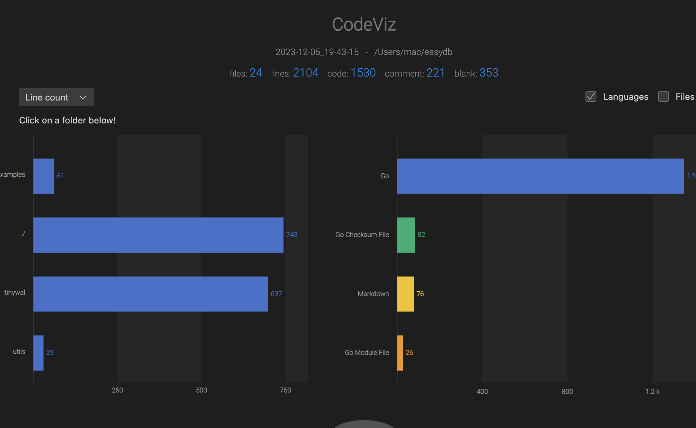
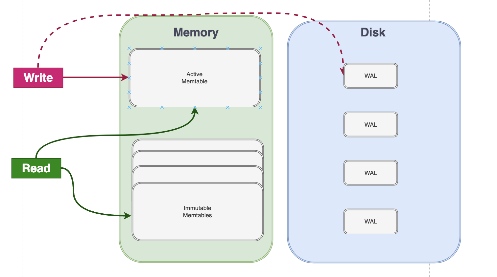
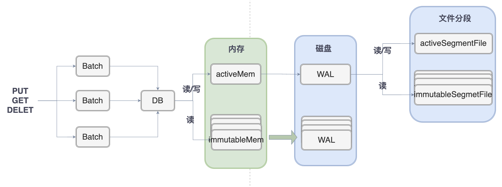
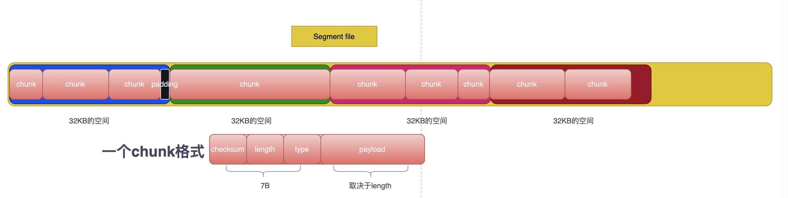
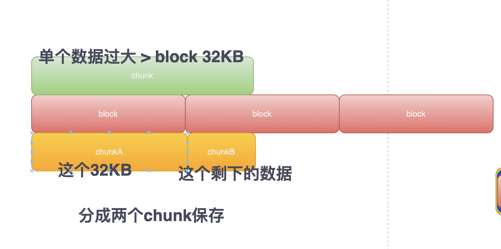
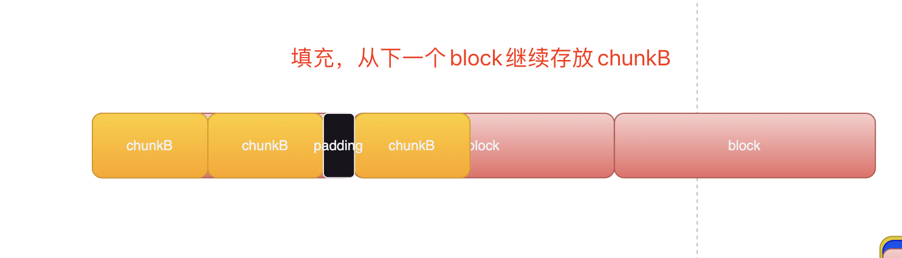

# Golang实现自己的KV存储引擎

通过本项目可以学到什么？

- `WAL`预写日志的实现
- LSM Tree（Log-Structed-Merge Tree)
- 如何构架一个企业级的项目
- KV数据的序列化和反序列化存储
- Golang的基本语法

项目已托管GitHub :  https://github.com/gofish2020/easydb 欢迎学习Star，如果有看不懂的欢迎私信

整个代码量不多，基本的大框架也好理解，容易出现错误的点在于代码细节的处理（特别是wal文件的读写部分）



## 简介

内存数据采用`SkipList` 存储

通过`WAL (Write Ahead Log)`保证内存数据`durability`和`crash-safe`能力



# 代码逻辑结构



1. 先通过`easydb.Open`打开数据库`*DB`对象；`*DB`内部基于`WAL`恢复内存数据`openAllMemtables`【就是读取`segment`文件，解析出一个个`LogRecord`保存到`skiplist`中】，同时将内存数据分成活跃内存和不可变内存【参考 LSM Tree结构】。每个内存对象`*memtable`内部除了定义`skiplist`记录内存数据，同时定义`*wal`对象记录磁盘，`*wal`对象中的磁盘文件按照指定的大小分段保存（这里类似kafka中日志数据文件分段原理）
2. 然后调用 `db.Put`方法，内部通过`batch`开启写事物（对db上锁），将数据批量保存`batch`的`pendingWrites`中,然后在`batch.Commit`一次性全部保存到内存和预写日志中同时关闭写事物（对db解锁）
3. 调用`db.Get`方法，内部通过`batch`开启读事物（对db上锁），读取所有的内存对象中的数据（倒序）方式，也就是从最近的内存对象`*memtable`开始读，读取结束，提交事物(关闭读事物，对db解锁)

建议从下面 `Open Get Put`这几个函数开始看起

```go
package main

import (
	"fmt"

	"github.com/gofish2020/easydb"
	"github.com/gofish2020/easydb/utils"
)

// this file shows how to use the basic operations of EasyDB
func main() {
	// specify the options
	options := easydb.DefaultOptions
	options.DirPath = utils.ExecDir() + "/data"

	// open a database
	db, err := easydb.Open(options)
	if err != nil {
		panic(err)
	}
	defer func() {
		_ = db.Close()
	}()

	// put a key
	err = db.Put([]byte("name"), []byte("easydb"), nil)
	if err != nil {
		panic(err)
	}

	// get a key
	val, err := db.Get([]byte("name"))
	if err != nil {
		panic(err)
	}
	println(string(val))

	// delete a key
	err = db.Delete([]byte("name"), nil)
	if err != nil {
		panic(err)
	}

	// get a key
	val, err = db.Get([]byte("name"))
	if err != nil {
		if err == easydb.ErrKeyNotFound {
			fmt.Println("key not exist")
			return
		}
		panic(err)
	}
	println(string(val))
}

```

# WAL日志格式



- `WAL`日志文件按照`SegmentSize`分成一个个的段文件；
- 每个段文件，按照` 32KB `为一块存储区域，存储 多个 `chunk`实际数据
- 每个`chunk`由 7 字节`header` + 数据`payload` 组成；`header`头包括 4字节校验码，2字节数据长度 1字节数据类型；校验码校验的范围为：【length + type + payload】确保数据没有损坏
- 一个数据可能由多个`chunk`组成



- 当在block中保存了多个chunk后，block剩余的空间不够保存数据，多余的空间浪费掉，填充一些无效字节即可

